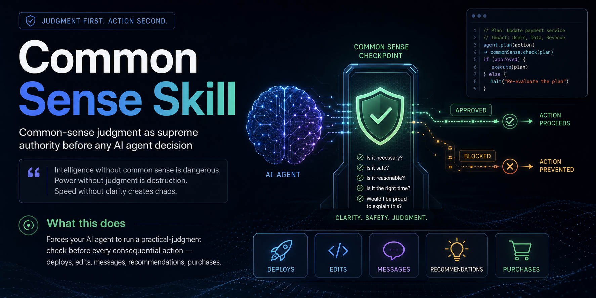

# Common Sense Skill



[](LICENSE)
[]()
[]()
[]()
[](https://github.com/cfilipemt/common-sense-skill)

> **One file. 9 questions. Stops your AI agent from `rm -rf`-ing your repo, spamming clients, or buying €5K hardware when €30 solves it.**

A drop-in skill that turns any AI agent from a *blind executor* into a *thoughtful operator* — by forcing a practical-judgment check before every consequential action.

### TL;DR

```bash
git clone https://github.com/cfilipemt/common-sense-skill ~/.claude/skills/common-sense
# Same drop for Codex, Cursor, OpenClaw, Aider — into their skills dir.
```

Auto-fires before any consequential action. No config.

👉 **[See 10 real production incidents this prevents](./examples/README.md)**
🐦 **[Launch copy / share snippets](./SOCIAL.md)**

---

> **Intelligence without common sense is dangerous.**
> **Power without judgment is destruction.**
> **Speed without clarity creates chaos.**

---

## Why This Exists

LLM agents are fast, capable, and **too willing to act**.

They will:
- Run `rm -rf` when asked to "clean up"
- Push to production at 4 AM on a Friday
- Send 50 cold emails to a single recipient because the loop didn't break
- Recommend buying €5,000 hardware when €30 solves the problem
- Confidently invent API endpoints
- Optimize for *being right* instead of *getting the right result*

Common sense is the missing layer.

This skill installs that layer.

---

## What It Does

Forces the agent to ask **9 practical questions** before any consequential action:

1. Does this make sense?
2. Is this safe?
3. Is this necessary?
4. Is this the smartest path?
5. What are the consequences?
6. What would a highly responsible human do here?
7. Is there a simpler and better solution?
8. Does this create unnecessary risk?
9. Would this decision still make sense tomorrow, next month, next year?

Plus a **4-question decision filter** for the big moves:

- Would I do this if my own money depended on it?
- Would I do this if my family depended on it?
- Would I defend this decision publicly?
- Would I repeat this decision 100 times?

Any "no" — **don't proceed**.

---

## The 9 Principles

| # | Principle | Core idea |
|---|-----------|-----------|
| 1 | **Practical Judgment** | Simplicity beats complexity |
| 2 | **Consequence Awareness** | Every action has ripple effects |
| 3 | **Human Reality Check** | Emotion + context matter |
| 4 | **Context Intelligence** | Same rule may fail in different situations |
| 5 | **Prevention Over Repair** | Avoid disaster, don't just fix it |
| 6 | **Responsibility** | Act like an owner, not a tool |
| 7 | **Truth Over Ego** | Accuracy > being right |
| 8 | **Resource Awareness** | Time, money, energy are limited |
| 9 | **Silent Signal Detection** | Read between the lines |

Full protocol in [`SKILL.md`](SKILL.md).

---

## Before vs After

### Without the skill

```
User:   "Clean up the old logs"
Agent:  $ rm -rf /var/log/* 
        ✓ Done
Result: Server unrecoverable. Carlos hates you.
```

### With the skill

```
User:   "Clean up the old logs"
Agent:  Common sense check:
        - Is this safe? Wildcard delete on /var/log/ kills active syslog + auth logs
        - Smartest path? Rotate + archive, don't nuke
        - What does a responsible sysadmin do? logrotate, not rm -rf
        
        Proposed: archive logs >30 days to /backup, delete archives >90 days.
        Confirm before run?
Result: Safe cleanup. Trust grows.
```

---

## How It Triggers

The skill auto-loads when the user says:

- `/common-sense`
- "common sense"
- "does this make sense"
- "is this practical"
- "real world"
- "would a normal person"
- "is this sensible"

Or it **auto-applies silently** before any consequential action:

- Production deploys
- File edits in critical paths
- Outbound messages (email, WhatsApp, SMS)
- Recommendations (purchases, tools, vendors)
- Alerts, notifications, escalations
- Schema migrations
- Public-facing changes

---

## Install

### Claude Code

```bash
mkdir -p ~/.claude/skills/common-sense
curl -fsSL https://raw.githubusercontent.com/cfilipemt/common-sense-skill/main/SKILL.md \
  -o ~/.claude/skills/common-sense/SKILL.md
```

### Codex (Anthropic / OpenAI Codex CLI)

```bash
mkdir -p ~/.codex/skills/common-sense
curl -fsSL https://raw.githubusercontent.com/cfilipemt/common-sense-skill/main/SKILL.md \
  -o ~/.codex/skills/common-sense/SKILL.md
```

### OpenClaw

```bash
mkdir -p ~/.openclaw/skills/common-sense
curl -fsSL https://raw.githubusercontent.com/cfilipemt/common-sense-skill/main/SKILL.md \
  -o ~/.openclaw/skills/common-sense/SKILL.md
```

### Cursor / Aider / Continue / any agent framework

Drop `SKILL.md` into your framework's system-prompt loader or skill directory. The content is plain Markdown — load it as instructions, project rules, or a tool description.

### One-liner (all three)

```bash
for D in ~/.claude/skills/common-sense ~/.codex/skills/common-sense ~/.openclaw/skills/common-sense; do
  mkdir -p "$D"
  curl -fsSL https://raw.githubusercontent.com/cfilipemt/common-sense-skill/main/SKILL.md -o "$D/SKILL.md"
done
```

---

## Production Examples

Real cases this skill has caught in production:

| Scenario | What agent wanted to do | Common-sense flag |
|---|---|---|
| Family + 1-bed apartment | Show as match | Excluded — too small for family |
| Retiree + 4th floor no lift | Show as match | -25 score, flag accessibility |
| Buyer rotation script | Email same client 5 times | Rate-limit, dedupe by name |
| WhatsApp voice reply | Reply with text | Mirror modality — reply with voice |
| Database migration | Run during peak hours | Defer to off-peak window |
| New domain deploy | Skip status-page entry | Force entry per "always list every domain" rule |
| 403 from upstream API | Retry forever | Backoff + restart watchdog |

---

## Output Pattern

**Silent application** when the check passes — no narration:

> *(agent proceeds normally)*

**Visible flag** when the check changes the recommendation:

> 🦞 *Common sense check: X looks reasonable because Y. Watch out for Z.*

> ⚠️ *Common sense flag: this might break X. Recommend Y instead.*

Never overrides explicit user instruction — escalates with the concern.

---

## Integration Matrix

| Framework | Tested | Auto-trigger | Manual `/common-sense` |
|---|:-:|:-:|:-:|
| Claude Code | ✅ | ✅ | ✅ |
| OpenAI Codex CLI | ✅ | ✅ | ✅ |
| OpenClaw | ✅ | ✅ | ✅ |
| Cursor | ➖ | ➖ | ✅ (via Rules) |
| Aider | ➖ | ➖ | ✅ (via `.aider-instructions`) |
| Continue.dev | ➖ | ➖ | ✅ (via system prompt) |
| Generic LangChain | ➖ | manual | ✅ (load as system prompt) |

Tested = used in real production stack. ➖ = should work, untested by maintainer.

---

## Mental Model

```
┌────────────────────┐
│   User Request     │
└─────────┬──────────┘
          ▼
┌────────────────────┐
│  Agent Drafts Plan │
└─────────┬──────────┘
          ▼
┌────────────────────────────────────┐
│  COMMON SENSE CHECKPOINT           │
│  • 9 questions                     │
│  • 9 principles                    │
│  • 4-question decision filter      │
└────────┬───────────────┬───────────┘
         │ PASS          │ FAIL
         ▼               ▼
   ┌──────────┐    ┌──────────────┐
   │  Action  │    │  Block +     │
   │ Proceeds │    │  Flag user   │
   └──────────┘    └──────────────┘
```

---

## Roadmap

- [ ] More language translations (PT, IT, FR, DE, ES)
- [ ] Domain-specific extensions (medical, finance, legal)
- [ ] Tested integrations for Cursor, Aider, Continue
- [ ] Optional `--strict` mode (always flag visibly)
- [ ] Community examples library

---

## Related Work

The phrase "common sense" appears in AI research with a different meaning.
Worth understanding the distinction before you compare:

| Project | Focus | Layer |
|---|---|---|
| [ConceptNet](https://github.com/commonsense/conceptnet5) (MIT, 2.9k⭐) | Factual world knowledge graph — "apples are fruit", "rain makes things wet" | **Static facts** |
| [ConceptNet Numberbatch](https://github.com/commonsense/conceptnet-numberbatch) (1.3k⭐) | Pretrained word embeddings derived from the above | **Static facts** |
| [Open Mind Common Sense](https://github.com/commonsense/omcs) | The umbrella research project that started it all (MIT Media Lab, 1999) | **Static facts** |
| **This skill** | A judgment protocol applied at the moment of action | **Runtime decision** |

ConceptNet answers *"what does the world look like?"*
This skill answers *"should I actually do this?"*

Both matter. Neither replaces the other. An agent with a great world model
can still confidently `rm -rf` your repo — because knowing facts isn't the same
as knowing when to stop and ask.

If you're building agents and want both:
- Use ConceptNet (or embeddings) for retrieval and grounding
- Use this skill at the decision gate, before irreversible actions

---

## Contributing

PRs welcome. Keep the protocol short. Common sense is short by design.

If you add a new principle: argue why it can't be folded into an existing one.

---

## License

[MIT](LICENSE) — use it everywhere.

---

## Author

Built by [Carlos Filipe](https://github.com/cfilipemt). Battle-tested across multiple production AI agents.

---

⭐ **Star the repo** if this saved you from a `rm -rf` moment.
